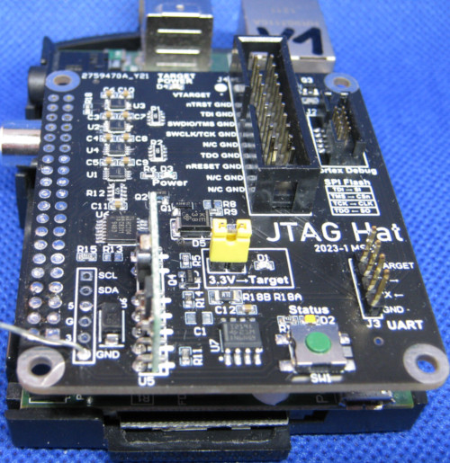
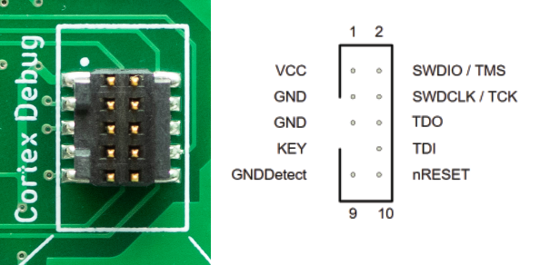
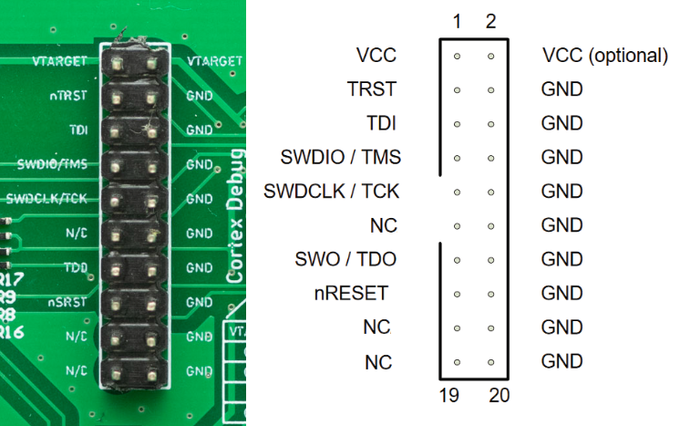
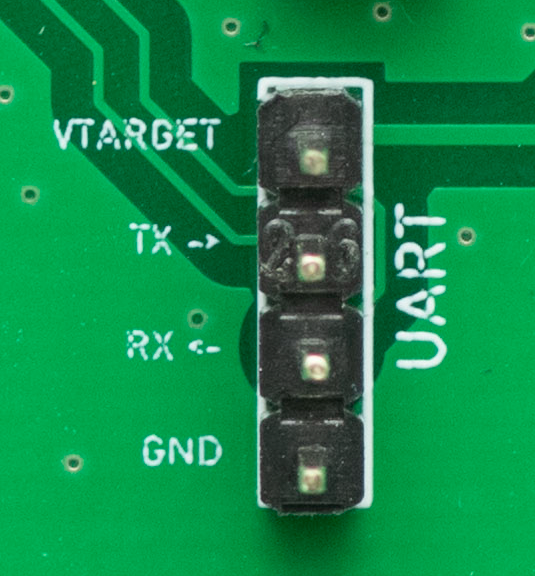
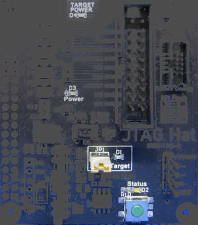

# JTAG Hat / Remix

This is a modified version of Blinkinlabs [JTAG Hat](https://github.com/Blinkinlabs/JTAG_hat). 

Convert your Raspberry Pi 1/2/3/4 into a networked JTAG debugger and SPI Flash Programmer!

The JTAG Hat is designed to work with [OpenOCD](http://openocd.org/), and
provides a .05" 10-pin [Cortex Debug Connector](https://documentation-service.arm.com/static/5fce6c49e167456a35b36af1),
with pins to support debugging devices with either a JTAG (TCK/TMS/TDI/TDO)
or SWD (SWDIO/SWDCLK) programming interface. A traditional .1", 20-pin ARM JTAG
header is also provided, which can be used with 0.1" jumper wires for more
flexibility. Furthermore, it can be used with [flashrom](https://www.flashrom.org/Flashrom/) 
to program SPI flash chips.

Features:

 * Level-shifted JTAG / SWD programming interface, supports 1.8V to 5V targets
 * Designed to work with OpenOCD, which supports debugging a large number of devices (STM32, ESP32, etc)
 * Can power your device from the RPi supply (3.3V)
 * Hardware reset (both SRST and TRST) via a pull-down transistor
 * Level-shifted UART interface connected to RPi serial port
 * Built-in voltage and current measurement of target device

This Remix version has the following changes:

 * change pinout so that a Raspberry Pi 1 / 2 with 26-pin GPIO connector can be used.
 * change pinout so that SPI programming of flashroms is supported by the "flashrom" tool.
 * changed parts to fit what I had available: 0603 resistors/capacitors, discrete single FETs.
 * make space for shrouded (keyed) 20-pin connector
 * update target power indicator LED circuit to work with low target voltages
 * add a LED to indicate that we are feeding 3.3V to the target
 * add a jumper to disable feeding 3.3V to the target
 * add simple over-voltage/reverse polarity protection to Vtarget pin (it's
   not 100% bullet proof against over-voltage, but better than nothing)
 * add a DC/DC converter so that 3.3V to the target is not pulled from the
   RPi's 3.3V, but is generated from the +5V supply
 * add a status LED and a button, connected to GPIO pins. These can be used
   for safe shutdown, or for standalone operation (programming of a pre-set
   image by button press).
 * add pull-down resistors on inputs to avoid problems due to floating inputs
   when no target is connected
 * add I2C connector to optionally attach an I2C display

All design files are in this repository to make your own.

## Setup

1. Use [Rasbperry Pi Imager](https://www.raspberrypi.org/software/) to image the micro SD card with 'Raspberry Pi OS Lite'

2. [Enable WiFi](https://www.raspberrypi.org/documentation/configuration/wireless/headless.md) by adding 'wpa_supplicant.conf' to the boot partition:

		country=US
		ctrl_interface=DIR=/var/run/wpa_supplicant GROUP=netdev
		update_config=1
		network={
			ssid="NETWORK-NAME"
			psk="NETWORK-PASSWORD"
		}

3. [Enable ssh](https://www.raspberrypi.org/documentation/remote-access/ssh/README.md) by adding an empty 'ssh' file to the boot partition:

		touch ssh

4. Boot the pi, and check your DHCP server to determine the IP address, then SSH into it

5. Copy the "scripts" directory from this repository to the Pi

		scp -r scripts pi@<ipaddress>:

5. Use 'sudo raspi-config', and set options as required:
   * system options/set password
   * system options/set hostname
   * system options/set boot/autologin/ to "console autologin"
   * interface options/enable ssh at boot
   * interface options/enable I2C
   * interface options/enable SPI (optional, for SPI flash programming)
   * interface options/Serial Port -> no login shell, serial interface enabled
   * performance options/GPU memory -> set to minimum
   * Localization options/set keyboard layout
   * Localization options/set locale
   * Localization options/set timezone

6. For button-press (standalone) programming:

		cp scripts/bash_profile ~/.bash_profile

7. Activate LED/Button support and disable Bluetooth (to enable using the UART port) for Linux kernel:

		sudo -i
		echo "dtoverlay=gpio-shutdown,gpio_pin=18,debounce=5000" >>/boot/config.txt
		echo "dtoverlay=gpio-led,gpio=17,trigger=heartbeat,label=hat_led" >>/boot/config.txt
		echo "dtoverlay=disable-bt" >>/boot/config.txt

6. Update packages and install git:

		sudo apt update
		sudo apt upgrade -y
		sudo apt install -y git autoconf libtool libusb-1.0-0-dev screen telnet raspi-gpio

7. Download and build OpenOCD:

		git clone https://git.code.sf.net/p/openocd/code openocd
		cd openocd
		./bootstrap
		./configure --enable-sysfsgpio --enable-bcm2835gpio
		cp ~/scripts/jtag_hat_ms.cfg tcl/interface/
		make -j1
		sudo make install

## Use it

### Connect using the Arm Cortex Debug connector

This connector works well if your target board has one of these connectors. This connector supports both JTAG and SWD connection modes, and has a reset pin controlled by 'SRST'.

-or-

### Connect using the 20-pin 'legacy' ARM JTAG connector

This connector works well if your target board has one of these connectors,
or if you want to use jumper wires to connect to .1" headers on a
board. This connector supports both JTAG and SWD connection modes, and has
both SRST and TRST reset pins. Note that some of the optional signals (RTCK,
DBGRQ, DBACK) are not supported by OpenOCD, and are not present on this
connector.

For SWD mode, you'll need at least GND,SWDIO, and SWDCLK. For JTAG mode,
you'll need at least GND,TCK,TDI,TDO, and TMS. Depending on target and debug
situation, one or both reset signals may be required as well.

### (optional) Enable target power

The JTAG Hat can provide a 3.3V supply to the target. To enable
it, RPi GPIO4 should be set to an output:

	echo 4 > /sys/class/gpio/export
	echo out > /sys/class/gpio/gpio4/direction
	echo 1 > /sys/class/gpio/gpio4/value

Similarly, to turn it off:

	echo 0 > /sys/class/gpio/gpio4/value

There is a script that can be called like this:

	scripts/scripts/target-power 1
	scripts/scripts/target-power 0

Note: If your target board has its own power supply, or works at a different
voltage than 3.3V, do not enable target power!

LED D1 on the board will light up when the target power feeding is
enabled. Jumper JP1 must be set to actually power the target, so remove that
when working with self-powered targets to avoid accidentally powering them
from the Pi.

### OpenOCD config file

OpenOCD master already contains support for the original Blinkinlabs JTAG
Hat. However, due to the Pi1-compatible pinout, we need a different config
file jtag\_hat\_ms.cfg

Start an OpenOCD session for an STM32F0 target:

		sudo openocd -f interface/jtag_hat_ms.cfg \
		-c "bindto 0.0.0.0; transport select swd" \
		-c "adapter speed 1000" \
		-f target/stm32f0x.cfg

Now you can connect to the server using GDB, and flash new code, dump things, etc.

## Sensing load current and target voltage

The hat includes an INA219 current sensor, which can be used to monitor the
target voltage and current when powered through the Pi, and the target
voltage when the target is self-powered. To use it:

1. Install the [Pi INA219 library](https://github.com/chrisb2/pi_ina219/blob/master/README.md):

		sudo apt install python3-pip
		pip3 install pi-ina219

2. Call the script scripts/sense_current.py:

		scripts/sense_current.py
		Bus Voltage: 3.280 V
		Bus Current: 95.000 mA
		Power: 311.707 mW
		Shunt voltage: 9.510 mV

Note that the current measurement includes the current through R4, as well
as the current used by the level translation buffers (about 0.5mA when
idle).

## UART header

The JTAG Hat also has a level-translated UART header. The UART situation on
Raspberry Pi is a [little complicated](https://www.raspberrypi.org/documentation/configuration/uart.md). 
The required setup steps are already included in the installation
instructions above.

Check that the serial port is configured correctly:

		ls -l /dev/serial0

This should now point to ttyAM0:

		lrwxrwxrwx 1 root root 7 Mar 24 15:10 /dev/serial0 -> ttyAMA0

## Standalone Operation

The dtoverlay configures the status LED D2 with "heartbeat" functionality,
and button "SW1" initiates system shutdown when pressed for more than 5
seconds.

If you copied the .bash_profile file, after booting the Raspberry Pi the following will happen:

- user "pi" will automatically be logged into the first text console
- .bash_profile is executed
- when this happens for the first time, scripts/loop.sh is run
- that script calls setup.sh to take control of the LED, turning it off.
- the script then polls the button (using the raspi-gpio command, since the GPIO pin is taken by the DT overlay and can not be exported).
- When the button is pressed, it lights the LED and waits for the button to
  be released again. Then, ~/flash/flash.sh is called. During flashing, the
  status LED blinks slowly (2Hz).
- if an error occurs, the status LED blinks fast (10Hz) for 5 seconds
- if everything is OK, the status LED is solid on for 3 seconds.
- press the button >5s to shut down the Raspberry Pi. Keeping it pressed for
  10s makes sure no flash operation is started while the shutdown is
  initiated.
- TODO: attach a small OLED display to the I2C connector to display current IP address, status etc.

I recommend making a sub-directory per programming target -
eg. ~/flash-gd32e230-blink, and make ~/flash a link to the currently used
directory. A copy of the flash.sh script is placed in each such directory in
order to select target power on/off per target, along with the required
openocd configuration and programming file. Switching between different
programming setups then only requires changing the link.

## SPI flash programming

The adapter can be used as a SPI flash programmer in combination with the
"flashrom" tool. In order to use flashrom, the SPI interface on the
raspberry pi needs to be enabled by un-commenting

        dtparam=spi=on

in /boot/config.txt (or by using raspi-config). The target needs to be wired up as follows:

- TMS -> CSn (input on flash)
- TDO -> DO (output on flash)
- TDI -> DI (input on flash)
- TCLK -> CLK (input on flash)
- HOLDn and WPn inputs on the flash chip must be tied "high"

After that, "flashrom" can be invoked as

	    flashrom -p linux_spi:dev=/dev/spidev0.0,spispeed=1000

"spispeed" is the clock speed in kHz - depending on your cabling and target,
higher speeds should be possible, I was able to program a MX25L4005 on a
breadboard, using 20cm wires, at 24MHz.

## LEDs/Jumpers

* D1: target power feeding enabled by software
* JP1: physically enable target power feeding (3.3V to target)
* SW1: user button, connected to GPIO18
* D2: Status LED, software-controlled by GPIO4.
* D3: Power (3.3V from RPi) present
* D4: Target power (VTARGET) present

## Hardware design

[Schematic (PDF)](pcb_ms_v3/Doc/Schematic.pdf)
[Schematic (PNG)](pcb_ms_v3/Doc/Schematic.png)

This repository contains the Altium Designer source files, as well as the
gerbers used for production. PDF files are in the Doc/ sub-directory, and a
BOM is in the BOM/ directory.

I have used parts that I have available - some of these may need
substitution. Notably, the MDS-G16 DC/DC module I used is obsolete, so you
might want to substitute this (or leave it out if you don't need the feature
to supply power to the target). Any small non-isolated step-down (buck)
DC/DC converter module that can do 4.5V -> 3.3V conversion and which has an
enable input should work.

LEDs have a wide range of operating currents depending on model - the series
resistors are set for the LEDs I had around, you will probably need to adapt
those.

The PCB was initially designed for a Raspberry Pi 3/4 with the 40-pin GPIO
connector, and the mechanical layout fits that version.

When using a Raspberry Pi 1/2 with the older 26-pin GPIO connector, the PCB
can't be screwed onto the Pi - one or two plastic spacers glued to the
bottom of the PCB solves this. Use a 26-pin connector for J1. The PCB will
rest on the video output connector - it's best to plug the connector and PCB
onto the Pi and then solder the connector so everything sits flat.

## License

Copyright Blinkinlabs 2021. Copyright Michael Schwingen 2021-2023.

The board design is [licensed under CERN-OHL-P v2](https://cern.ch/cern-ohl) and documentation is released under [Attribution-ShareAlike 4.0 International](https://creativecommons.org/licenses/by-sa/4.0/legalcode)

<!--  LocalWords:  Blinkinlabs TCK SWD SWDIO SWDCLK flashrom STM RPi SRST
 -->
<!--  LocalWords:  TRST UART pinout GPIO flashroms conf DHCP sudo raspi GND
 -->
<!--  LocalWords:  RTCK DBGRQ DBACK TDI TDO TMS GDB Altium gerbers
 -->
