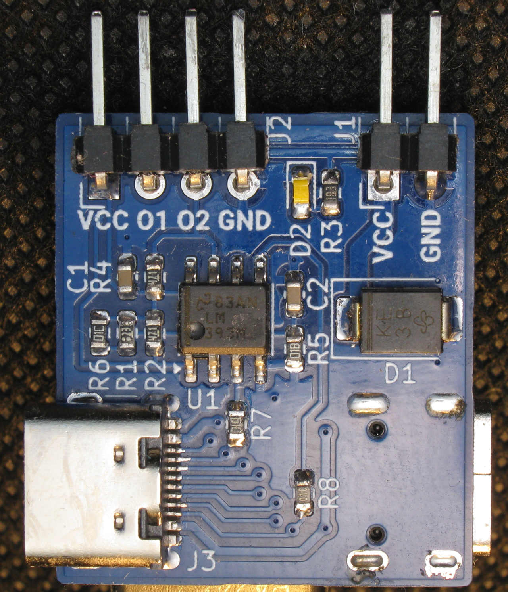
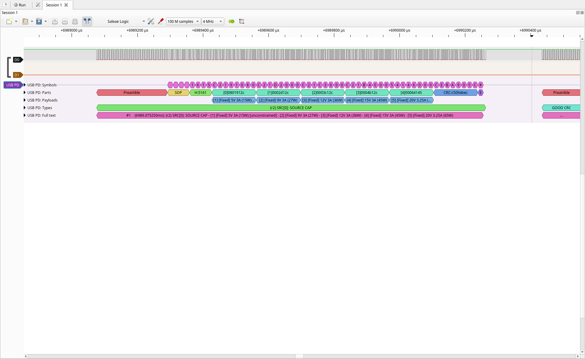

# USB-C PD sniffer for logic analyzer

When debugging USB power delivery problems, a deep look into what is happening on the CC signals on the wire is helpful. Fortunately, the sigrok/pulseview software that works with many cheap USB logic analyzers has decoders for the USB PD protocol.

However, the logic "1" voltage on the CC lines during the PD handshake is only in the order of 1V - too low for most logic analyzers.

Since the speed is quite low (300kbps), this can be solved easily by using the good old LM393 comparator, with a reference voltage of about 0.5V.

This board has two USB-C sockets which are connected straight-through for easy connection between whatever devices you want to analyze.

## Design notes
The PCB uses 16-pin USB2.0-only USB-C connectors, since these are easy to hand-solder and deemed sufficient for the task. All signals are connected straight between both connectors (with VBUS and GND pins joined together). For easier layout, one of the connectors is on the bottom of the PCB.

Connecting two USB sockets in this way creates one problem: the orientation of the cable from the sniffer to the device matters, since USB-C cables do not connect all pins - there is a working and a non-working orientation, and I purposely did not put bridges between signal pins in order to keep the board as non-intrusive as possible. I suggest to try both orientations and then mark the cable and connector - in the wrong orientation, you will get neither PD handshake nor a USB data connection.

The PCB is meant to be used exclusively with USB-C - USB-C cables and USB-C power supplies / devices. Do not use it to create contraptions that are not allowed in the USB standard (like connecting two USB-A - USB-C cables).

## Using it
Connect GND, OUT1 (CC1 signal, marked "O1") and OUT2 (CC2 signal, marked "O2") to the logic analyzer. 

Supply +5V power to the VCC and GND pins - either from a laboratory power supply, power bank etc. If your logic analyzer has a +5V output pin, you can use that, too. The LED indicates power is present.

Make sure +5V is connected before powering up the USB devices, to avoid loading the CC pins via the 10k resistors and powered-down LM393.

Fire up pulseview and configure the inputs. A sample rate of 2-4MHz should be sufficient. Add the USB PD decoder to the inputs.

Start capturing data and plug in / power up the USB devices.

## License
The hardware design is licensed under the CERN-OHL-S v2 license:
https://ohwr.org/cern_ohl_s_v2.txt
