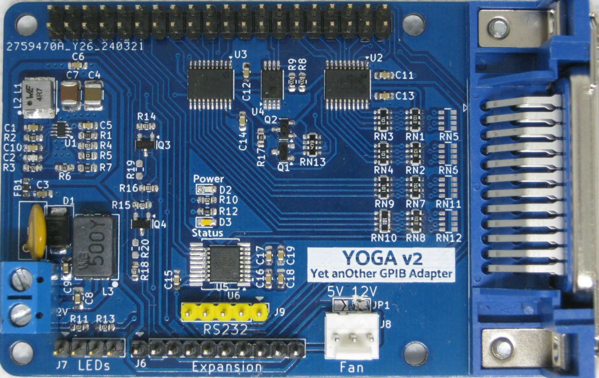

# YOGA: Yet AnOther GPIB Adapter

This is a GPIB interface that is attached to the GPIO connector of a Raspberry Pi, using the [Linux GPIB](https://linux-gpib.sourceforge.io/) driver package.

It is similar to the existing elektronomikon [Raspberry Pi GPIB
Shield](https://github.com/elektronomikon/raspi_gpib_shield) and other GPIB
shields for the Raspberry Pi.

However, all existing designs I could find either directly connected the
GPIB bus to the Raspberry Pi's GPIO pins, or used SN7516x bus drivers. Both
may expose the GPIO pins to voltages that are higher than the allowed 3.3V -
the risk may not be high, but I did not want this for reliable long-term
operation.

Since I needed to integrate the GPIB interface into an existing 19"
measurement rack (to control a Maturo MCU unit), the YOGA PCB has the
following features:

 * proper level shifters to protect the Raspberry Pi from voltages above 3.3V.
 * a RS-232 interface (including RTS/CTS handshake) for use as an emergency
   console
 * a 12V to 5V DC/DC converter, so that the whole unit can be powered from a
   12V DC supply, including input protection in case this is an external
   wall wart.
 * a fan connector (5V/12V selectable)
 * an expansion header with 2 free GPIO pins plus an I2C bus (selectable 3.3V or 5V, used
   to connect an OLED display, and a I2C motor driver board to control an
   additional antenna positioner in our setup)
 * Two options to connect the GPIB cable: either a board-mounted 24 pin
   centronics-style GPIB connector (shown on the picture), or a 26-pin IDC
   connector for connection of a flat cable with a GPIB connector at the end
   (which matches an existing HP cable I had from an old machine).
 * Two LEDs (power and activity), plus a connector to attach case-mounted LEDs.

As a downside, the level shifters are LSF0108 FET-types, so the output drive
comes directly from the Raspberry's GPIO pins - this does not meet the GPIB
output drive requirement of 48mA for a fully loaded bus. However, it is fine for 1-2 devices.

If you needed to drive a full bus, combining the LSF0108 level shifters with
SN7516x GPIB drivers would be an option, but I did not want to add that
complexity for a use case I did not need.

Note: I first tried using TXS0108E level translators, which should
in theory provide faster operation - however, these do not like the
capacitive load of even a short GPIB bus and start to oscillate.

All design files are in this repository to make your own. Due to the amount
of optional features, you can leave out parts you do not need (like the
DC/DC converter if you want to power the Raspberry Pi from its USB connector).

The design has been tested on a Raspberry Pi 2B and 3B (the 40-pin connector
is needed, so the older Raspberry Pi 1/2 with the 26-pin connector can not be used).

## Hardware design

[Schematic and Layout (PDF)](Doc/yoga_v2.pdf)

This repository contains the KiCad source files, as well as the gerbers used
for production. PDF files are in the Doc/ sub-directory, and a BOM is in the
BOM/ directory.

LEDs have a wide range of operating currents depending on model - the series
resistors are set for the LEDs I had around, you will probably need to adapt
those.

All capacitors are ceramic types, X5R/X7R or C0G/NP0.

### 12V Input
the circuit around U1 forms a DC/DC converter that can be powered from a 12V
supply and delivers 2A at 5V to power the Raspberry Pi. Input protection
(D1/F1) protects against reverse polarity or overvoltage - if you use a power
supply that is permanently attached, you may leave these out. L1/L2 are
alternative footprints to match multiple suitable inductors.

If the 12V DC/DC converter is used, the 5V input (USB) on the Raspberry Pi
may *not* be used!

If you want to power the Raspberry Pi from a 5V supply, leave the complete
circuit around U1 unpopulated.

### GPIB interface

U2/U3 are the level shifters for the GPIB bus. The 100 ohm series resistors
and 10k pullup resistors are fine for 1-2 GPIB devices, where the full GPIB
termination (3k pullup / 6.2k pulldown) is not needed.

J4 is the normal 24-pin board-mounted centronics connector. J3 (overlapping
footprints) is for a 26-pin IDC connector (0.1" pitch) that matches my
existing HP cable. You can make an equivalent by connecting a 26-pin IDC
connector on one end of a 26-pin flat cable, and attaching a 24-pin IDC
centronics connector (either male or female) to the other end as shown on
the schematic.

The level shifters are enabled by a high level on the ENABLE signal
(GPIO18). This makes sure that the circuit is disabled after power-up until
the GPIB driver software is loaded, so the bus is not disturbed. Also, this
prevents the GPIB devoces from back-feeding the Raspberry's GPIO pins when power is off (which may prevent the Pi from booting when power is then applied, as happens with the simple resistor-only GPIB interfaces).

### Raspberry Pi Interface

The pinout on the Raspberry Pi side (J5) is slightly different than on
existing GPIB hats, to facilitate a better PCB layout. U4 is a I2C EEPROM
for hat-autodetection (since I wanted to experiment with this), but this
does not seem to provide a benefit, so I would suggest to leave U4
unpopulated.

There are two ways to connect the YOGA PCB to the Raspberry Pi:

 * the classical hat mounting: a female connector on J5, on the bottom side of the PCB, with the YOGA pcb stacked on top of the Raspberry Pi.
 * A male 2*20 pin connector on J5, on the top side (as shown on the    photo). A 40-pin flat cable (like those used for IDE drives - but not the 80-pin UDMA version) is then used to connect the YOGA PCB to the    Raspberry, sitting side-by-side. This is flat enough to fit the whole    setup into a 1U 19" enclosure (44mm height) when using 5mm spacers on the bottom of the PCBs.

### RS232 console

Connector J9 provides a RS232 console (RXD/TXD/RTS/CTS) for connection to a DB-9 (female) connector. When mounted in a housing without access to the HDMI connector, this provides console access without opening the case. See
[Doc/uart-conn.png](Doc/uart-conn.png) for wiring instructions.

The PCB has options for 2 different RS-232 transceiver ICs (U5 and U6,
overlapping footprints) - use whatever is better available, or any
compatible part from a different manufacturer.

### LEDs

* D2: power, connected to +5V supply.
* D3: Status LED, software-controlled by Linux-GPIB software.

Connector J7 can be used to connect external LEDs.

### Fan

Connector J8 can be used to connect a fan (the pinout matches the common
3-pin PC fan). Solder jumper JP1 selects between 5V or 12V fan supply.

### Expansion

Connector J6 can be used to connect additional circuitry: there are 2 unused 3.3V GPIO pins (GPIO7, GPIO8), plus a I2C bus that is level-shifted to 5V by Q3/Q4. If you need a 3.3V I2C bus, leave out Q3, Q4, R16, R18 and instead populate R19 and R20.

### EEPROM

The PCB has the option to connect a I2C EEPROM (U4) to provide HAT configuration / device tree overlay information, mainly because I wanted to experiment with this. It looks to me that this provides no real value, since additional configuration is needed anyway. I recommend to leave the EEPROM out and ignore the contents of the software/eeprom/ folder.

## Software Setup (WIP)

1. Use [Rasbperry Pi Imager](https://www.raspberrypi.org/software/) to image the micro SD card with 'Raspberry Pi OS Lite'

2. [Enable WiFi](https://www.raspberrypi.org/documentation/configuration/wireless/headless.md) by adding 'wpa_supplicant.conf' to the boot partition:

		country=US
		ctrl_interface=DIR=/var/run/wpa_supplicant GROUP=netdev
		update_config=1
		network={
			ssid="NETWORK-NAME"
			psk="NETWORK-PASSWORD"
		}

3. [Enable ssh](https://www.raspberrypi.org/documentation/remote-access/ssh/README.md) by adding an empty 'ssh' file to the boot partition:

		touch ssh

4. Boot the pi, and check your DHCP server to determine the IP address, then SSH into it (as root):

5. Copy the software subdirectory to the raspberry. Install required packages and compile device tree overlay:

		apt update && apt dist-upgrade
		apt install device-tree-compiler i2c-tools raspi-gpio build-essential python3-smbus bison m4 subversion gpiod
		# set I/O and boot configuration
		raspi-config nonint do_i2c 0
		raspi-config nonint do_spi 1
		raspi-config nonint do_serial_hw 0
		raspi-config nonint do_serial_cons 0
		raspi-config nonint do_camera 1

6. Compile the device tree overlay for the serial console:

		cd software/rtscts
		make
		cp uart-rtscts.dtbo /boot/firmware/

7. Set boot options to enable serial console and LED:

		sed -i -e 's@display_auto_detect=1@display_auto_detect=0@' /boot/firmware/config.txt
		echo "[all] >>/boot/firmware/config.txt
		echo "gpio=4=op,dl" >>/boot/firmware/config.txt
		echo "gpu_mem=16" >>/boot/firmware/config.txt
		echo "dtoverlay=disable-bt"       >>/boot/firmware/config.txt
		echo "dtoverlay=uart-rtscts.dtbo" >>/boot/firmware/config.txt
		echo "dtoverlay=gpio-led,gpio=4,trigger=heartbeat,label=hat_led" >>/boot/firmware/config.txt

		# display IP address on console:
		sed -ie 's@ \\n \\l@  \\4{eth0}  \\n \\l@' /etc/issue

8. Compile linux-gpib code:

		cd /usr/src
		mkdir gpib
		cd gpib
		git clone git://git.code.sf.net/p/linux-gpib/git linux-gpib-git
		# copy in YOGA-patched file as long as it is not included upstream
		cp software/gpib_bitbang.c	 /usr/src/gpib/linux-gpib-git/linux-gpib-kernel/drivers/gpib/gpio/
		cd /usr/src/gpib/linux-gpib-code/linux-gpib-kernel/
		make clean
		make
		make install
		cd /usr/src/gpib/linux-gpib-code/linux-gpib-user/
		make clean
		make
		make install
		ldconfig
		cd /usr/src/gpib/linux-gpib-code/linux-gpib-user/language/perl
		perl Makefile.PL
		make
		make test
		make install
		cp software/gpib.conf /usr/local/etc/
		<modify gpib.conf as required>
		# gpio_base = 0 for old kernels, 512 for 6.6 and newer, see /sys/class/gpio/
		echo "options gpib_bitbang gpio_base=512 sn7516x_used=0 pin_map=yoga debug=1" >/etc/modprobe.d/gpib.conf

9. Reboot the system

		reboot

10. Load GPIB module

		ssh root@raspberry again
		modprobe gpib_bitbang
		gpib_config

11. Test it!

		echo "*IDN?" | ibterm -d 4
->

		ibterm>HEWLETT-PACKARD,34401A,0,3-1-1
		ibterm>
		ibterm: Done.

## License

Copyright Michael Schwingen 2024.

The hardware design is licensed under the CERN-OHL-S v2 license:
https://ohwr.org/cern_ohl_s_v2.txt
and documentation is released under [Attribution-ShareAlike 4.0 International](https://creativecommons.org/licenses/by-sa/4.0/legalcode)

The Linux GPIB code and my modifications to it is under their original license.

<!--  LocalWords:
-->
