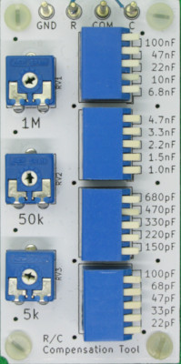

# R/C compensation tool

Similar to [Analog Devices
LB-013](https://www.analog.com/media/en/dsp-documentation/evaluation-kit-manuals/lb013b.pdf),
this is a simple R-C-network that is useful when optimizing the loop
compensation of switching regulators. I made this to use parts I had around
(especially the 5-pin DIP switches), primarily because a nice PCB with
silkscreen is a lot prettier than a bit of perfboard.

The PCB with all switches open has ca. 12pF of capacitance.

This is a KiCad design, however, there are PDFs and fabrication-ready gerber
files in case you simply want to make your own.

