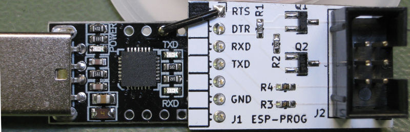

# ESP-Prog
ESP8266/ESP32 programming adapter

This small PCB is an add-on for a standard CP2102 USB-to-serial dongle that adds the reset/programming circuit required to upload new firmware without manual interaction so that the target board needs no extra parts except for the programming connector.
Since there does not seem to be a standard programming connector pinout, I decided to use a 2*3 pin connector, with VCC/GND/Reset on the same positions as on an AVR ISP connector.
There are THT and SMD versions - THT was basically used to document the wired prototype.

This design is licensed under the CERN-OHL-S v2 license:
https://ohwr.org/cern_ohl_s_v2.txt
