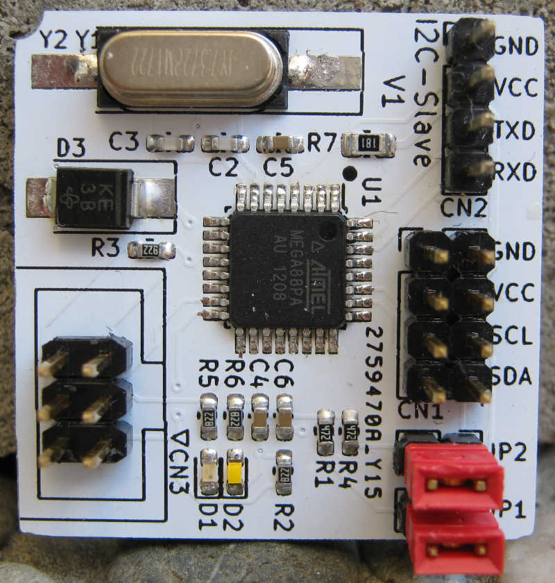

# I2C slave with fault injection

This project is a small I2C slave device that is useful during
implementation / testing of I2C host drivers. This makes it possible to test
the behaviour of I2C host drivers in a reproducible way, and allows for some
level of automated driver testing.

Compared to using a normal I2C slave (like a LM75 or I2C EEPROM) for tests,
the firmware presented here can be used to test error paths in I2C master
drivers:

 - write transfers that are NACK'd after n bytes
 - bus fault testing where the device keeps SDA low, and the master has to
   wiggle SCL in order to un-wedge the bus.

These are important to get right, but difficult to test reproducible using
"normal" hardware.

## Acknowledgements

There is a I2C fault injection/testing framework for Linux, which runs on
devices with an I2C slave:

[https://www.kernel.org/doc/html/latest/i2c/gpio-fault-injection.html](https://www.kernel.org/doc/html/latest/i2c/gpio-fault-injection.html).

[https://www.youtube.com/watch?v=2UU_26rlJHs](https://www.youtube.com/watch?v=2UU_26rlJHs) has a presentation from Wolfram Sang about using this framework.

This provided some good ideas on what kinds of errors should be tested.
However, I had no supported hardware at hand, and I wanted something small
that can be easily attached to a board under development.

## Design notes

The device needs to have an I2C slave that handles the basic low-level
protocol including clock-stretching, but leaves as much of the higher-level
protocol up to the firmware (the STM32 I2C unit does too much in
hardware). The ATmega devices fit that requirement fine, and the
ATmega88/168/328 has an address mask register which enables it to respond to
multiple I2C addresses - this makes it easy to trigger different behaviours
by accessing different target addresses.

In addition to the normal ATmega I2C connection, the SCL/SDA signals are
wired to a second set of GPIO pins that are used for fault injection.

## The circuit

The design is a basic ATmega design - you can use one of the many ATmega328
boards, but the code will fit just fine into an ATmega88.

Board choice is dictated by supply voltage: if your I2C bus runs at 5V, you
can use an Arduino Nano. Otherwise, it is probably best to use a board that
can be powered from the host you are testing.

I designed a small PCB with an ATmega88 that is powered from the host, so it
will run at any voltage that is supported by the MCU. Below 3.3V, the LEDs
will probably not work.

The 7.3728MHz crystal is mainly for UART operation - if you do not need UART
output, or can live with lower baudrates, using the internal 8MHz RC
oscillator will work, too (after modifying the fuse bits).

## Compiling the firmware

The provided Makefile assumes a commandline environment with avr-gcc available.
Select one of:

> make PROGRAM=i2cslave_m88

for my PCB (ATmega88, 7.3728MHz crystal)

> make PROGRAM=i2cslave_m328

for a generic ATmega328 with 8MHz crystal

> make prog

will program the generated hex file into the board using the avrdude programmer selected in the Makefile.

> make fuses

will program the fuse bits accordingly.

## Using it

Attach the slave device to the device-under-test I2C bus, making sure to
have pullup resistors on the bus (there are jumpers on my PCB to enable
pullup resistors if needed).

Look at the sample code in host-sample/main.c. The firmware default is to
respond to slave addresses 0x60 .. 0x6F, with different reactions depending
on address - see the comments in i2cslave.c for details.

You may connect a TTL UART converter to the UART port of the ATmega to read
debug messages - every I2C transaction is printed to the UART port. During
development, it may also be useful to connect a scope or logic analyzer to
the I2C bus to see what is going on on the bus, and if it matches your
expectations.

## References

[Analog Devices AN-686: Implementing an I2C
Reset](https://www.analog.com/media/en/technical-documentation/application-notes/54305147357414AN686_0.pdf)
describes how the bus can become stuck with SDA pulled low by the slave, and
what to do against it.

<!--  LocalWords:  ATmega GPIO Nano MCU LEDs UART baudrates Makefile avr
 -->
<!--  LocalWords:  commandline gcc cslave prog avrdude pullup
 -->
