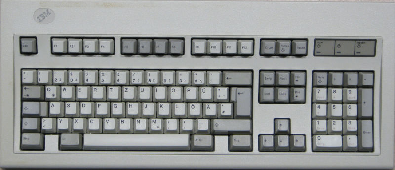
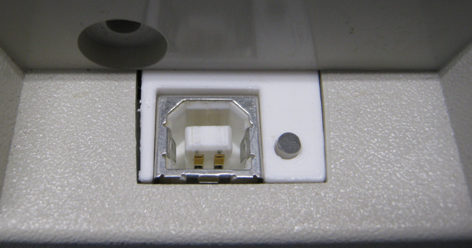
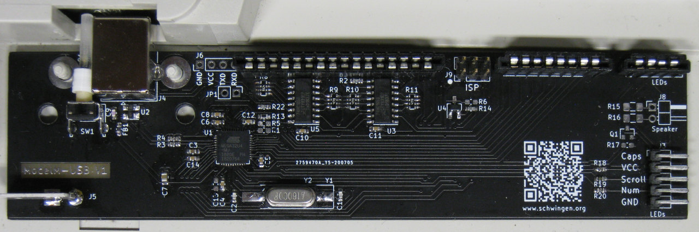
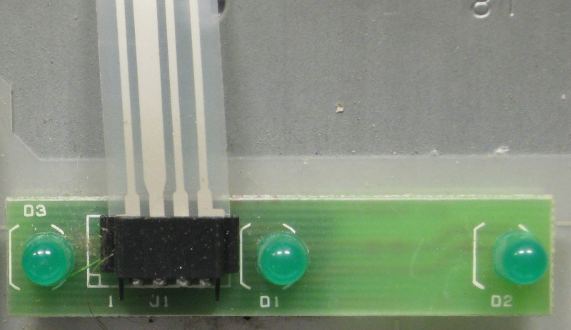
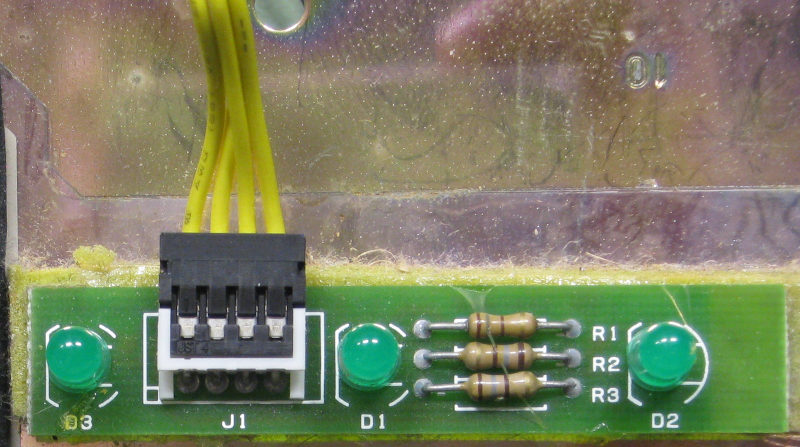
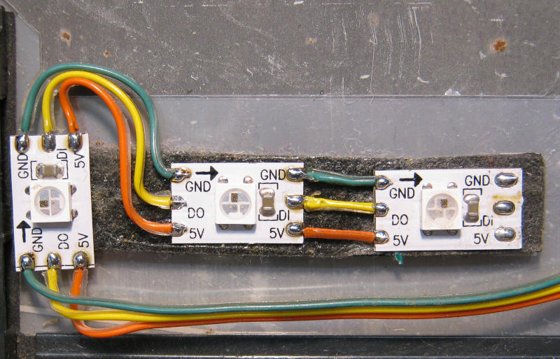
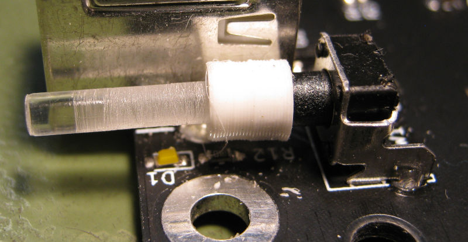
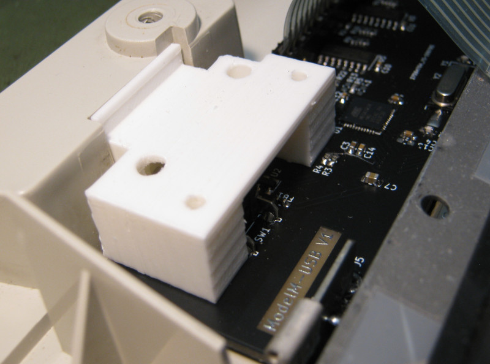

# USB interface for IBM Model M keyboard

The IBM Model M keyboard is a beast: weighing roughly 2kg, the buckling
spring mechanism provides a unique feel (and a loud clicking sound that will
drive your co-workers nuts). I learned to love these keyboards quite some
time ago, when people started throwing them out to get new, "modern"
keyboards. Unlike these, a Model M is nearly indestructible - the one I am
typing this text on has "copyright 1985" printed on the bottom label, and
the IC datecodes are from 1989.

While my current PC setup with the accompanying KVM switch still has PS/2
connectors, USB-only machines are coming up.

PS/2-to-USB converters exist, but they are like a box of chocolates - you
never know what you're gonna get. Some don't work at all with a Model M,
some work fine most of the time but get flaky occasionally.

This is a replacement PCB for IBM Model M keyboards. Instead of using an
external converter, we replace the complete electronics of the keyboard with
a new one with a USB socket:

This gets us reliable operation, plus some extras: changeable and extensible
keyboard layouts, a macro recording function, all those extra keys that a
modern multimedia keyboard has plus all the other features that the [Quantum
Mechanical Keyboard Firmware](https://docs.qmk.fm/) has to offer.

There are multiple versions of the original PCB, this replacement should fit
most keyboards that have a detachable cable. Keyboards with a fixed cable
probably have a PCB where the keyboard matrix is heat-bonded directly to the
PCB without a connector, making a replacement difficult.

## Acknowledgements

This is not the first such project. I looked at multiple breadboard conversions using teensy or similar boards, and then at

[https://github.com/ashpil/Model-M-Type-C-Controller](https://github.com/ashpil/Model-M-Type-C-Controller). That
was a good start (it provided part numbers for the FFC connectors, and
pointed my at the QMK firmware project, instead of the TMK firmware which I
was planning to use before). However, I did not like some parts of the
design, so i decided to roll my own.

[https://www.johnhawthorn.com/2020/07/modelh-keyboard-controller/](https://www.johnhawthorn.com/2020/07/modelh-keyboard-controller/)
showed up after I finished my design - it seems he made some of the same design decisions I did.

## Design goals

I wanted to achieve the following goals:

- The PCB should be a drop-in replacement for the original PCB and be
  compatible with as many variants as possible (at least those I had access
  to). Since there are keyboards with clamps for the smaller 150mm*37mm PCB
  in the bottom housing, the new PCB could not be bigger than that. No
  modifications to other parts of the keyboard should be necessary so that
  the modification can be reversed.
- Use a sturdy USB connector (ie. a standard type B socket) that is placed
  directly in the original cutout in the housing. I don't like SMD
  connectors - I accidentally ripped the micro connector from the pro micro
  board on which my prototype was built, and I have similar experience with
  other SMD connectors. A big, heavy device like the Model M deserves a
  connector that does not break if you move the keyboard. Also, the smaller
  connectors make it difficult to fit them in a back plate with 1-2mm
  thickness while still matching standard cables.
- Use a moderately modern controller chip - STM32 or ATmega32u4. Software
  support for the AVR looked better, so I chose that - however, the
  available I/O pins required some port extension which is easily provided
  by two cheap 74HC165 chips.
- Provide a bootloader and a means of entering it to upload a new firmware,
  without opening the case. I decided to have a separate push button that
  activates the bootloader when it is pressed during power-up (QMK's
  bootloader does not support hardware with port extenders). It was possible
  to put the button on the side of the USB connector in the original cutout,
  with the (transparent) rod doubling as a lightpipe for a status LED,
  giving a nice overall look.
- As an optional add-on, replace the 3 green LEDs with WS2812 RGB LEDs.

## Design notes

There are options on the PCB that can be populated in multiple ways.

The crystal J1/J2 can be either HC49SMD or THT.

Reset generator U4 is optional - if you trust the internal reset circuit in
the ATmega, you can leave out U4, R14 and instead populate R6 and C13.

Jumper JP1 is currently not used.

U1 footprint is meant for hand soldering, with a big hole in the center
ground pad.

The Model M bottom housing is prepared for a 50mm speaker.  The speaker
option on the PCB does not work as-is with QMK due to missing support for
PWM output on pin PC7 - I should have used PC6, but this was a last-minute
add-on without checking the software side. If you really want the speaker,
you can disconnect PC6 from the "button" signal and bridge it to PC7. It
works, but I found no real use for the speaker functions. This shall be
fixed in V2.

The UART connector J6 is only for debugging. It collides with the
installation of the 3D-printed backplate part, so it is best not populated
unless you really need it (also on the TODO list for V2).

SPI programming connector J9 is a bit close to J2 - you need a narrow
programming connector. Since you usually only need this once to program the
bootloader and the fuses, you might as well do that before populating J2
(also on the TODO list for V2).

The status LED D1 needs to be bright, since it shines into the lightpipe
from the side. I used a warm-white 0603 LED that is quite bright at
0.1mA. Using a 1k resistor for R12, it draws ~2.4mA and gives a nice visible
indication the the end of the lightpipe. Use a modern, high-efficiency LED.

LED connectors J3 and J7 are wired in parallel and can both be used,
depending on the connector on the original PCB. Unfortunately, the pinout is
different so that you need different firmware depending on which LED board
you use. Labeling on J3 in the schematic and on the PCB is for the wired
version, while J7 is labeled for the FFC version.

To get enough I/O ports, the 16 keyboard row signals are read using 2
74HC165 parallel-to-serial shift registers. These are read by the hardware
SPI block of the controller, running at 4MHz. The keyboard columns are
driven by GPIO ports on the controller, which are only set low or high-Z, so
no external diodes are required.

## Building

Assemble the PCB according to the BOM. Take note of the orientation of the
TE connectors for the FFC cables: the flat side of the connector should be
on the side where the foil is metallized.

There are three options for the indicator LEDs:

- Original LED board with FFC: use 4-pin TE connector on pin 1-4
of position J3 or J7, use 120&Omega; for R18..R20.

- Original LED board with wires. Use standard 90° pin header on pin 1-4 of
  position J3[^1], use 0&Omega; for R18..R20.

- WS2812 RGB LEDs instead of the original LED assembly. Use standard 90° pin
  header on pin 2-5 of position J3 or J7, R19 = 0Ohm or 120Ohm, connect VCC,
  GND, Scroll Lock = DIN of WS2812. The first LED in the chain is num lock
  (left), followed by caps lock (middle) and scroll lock(right). If you
  mount the first LED so that the input is on the top, wiring is easier (I
  got fooled by the "DI/DO" labeling).
  

## Bootloader
The ATmega32U4 comes with an USB bootloader pre-installed. You can use that
bootloader, however, LED D1 will not be active during bootloader operation.

Alternatively, you can use my modified LUFA-based USB bootloader. To use
this, you need to program the bootloader from
[here](https://github.com/mschwingen/modelm-lufa-bootloader/tree/master/release)
via ISP. Using that bootloader, you get a blinking LED during bootloader
operation and correct USB descriptors.

In both cases, the bootloader is activated by pressing the button while
plugging in the USB cable.

## Compiling the firmware

Setup the QMK build environment as described in the project documentation.

The different LED options require different firmware settings, so you need
to select the correct firmware to build and flash. Select one of:

> make mschwingen/modelm/led_wired:default

> make mschwingen/modelm/led_ffc:default

> make mschwingen/modelm/led_ws2812:default

Activate the bootloader and flash the firmware using one of:

> make mschwingen/modelm/led_wired:default:dfu

> make mschwingen/modelm/led_ffc:default:dfu

> make mschwingen/modelm/led_ws2812:default:dfu

## Assembly

A complete build needs additional parts, some of which need to be 3D-printed:

 - 2 screws, EJOT PT K30x12 WN 1452. Don't look too hard for these exact
   screws - use anything that holds in a 2.5mm hole - M3 might work, or M2.5
   plus a nut on top.

 - a bit of Lightpipe: acrylic rod, d=2.6mm, about 14mm long

print "Lightpipe Adapter.stl". Print this part with the smaller hole
standing on the build platform.

Check if the bigger hole of the adapter ring fits easily on the button. If
necessary, enlarge slightly using a drill bit.

Sand the outside of the lightpipe and insert it halfway into the adapter
ring (smaller hole). This should be a moderately tight fit to ease assembly.

Print "USB Backplate.stl". Print this part with the visible back side
standing on the build platform, using supports (on the platform only),
15%-20% infill. The overhanging parts will not be visible, so no excessive
cleanup is required.

Check the round holes - if they came out a bit too small, use a 2.5mm drill
bit for the mounting holes and 2.8mm-3mm for the lightpipe hole. The
lightpipe should slide into the hole without force.

Temporarily place the lightpipe with adapter ring on the button. Slide the
backplate part over the lightpipe. The backplate should be flush with the
bottom of the USB connector. Note the length of the protruding lightpipe and
cut or sand the lightpipe so that about 0.5mm - 1mm protrudes past the
backplate. Sand the end of the lightpipe.

If everything fits, put a drop of glue into the adapter ring and place it on
the button. Attach the backplate to fix the lightpipe into the right
position and let the glue dry. 

Attach the backplate to the PCB using the 2 screws from the bottom (using
the 2 smaller holes).

The PCB assembly is held in the housing by the two pins that protrude from
the bottom housing through the PCB, and is clamped down by a flat part of
the top housing that presses on the backplate adapter part from the top,
just like with the original connector.

The original PCBs come in two sizes - this design matches the smaller
one. If your keyboard had the bigger PCB, then the new PCB does not latch
into the housing in the lower/right corner. 

However, even with the PCB hanging in the air, I do not think this is a
problem - the PCB is fixed quite nice at the connector where force will be
applied during (un)plugging.

If you really want to have your PCB fixed in both corners, you can:

- fix the PCB in place using a bit of glue, or double-sided adhesive foam
  tape (IBM did this in some variants before changing the mold for the
  bottom part).
- 3D-print "Big PCB Adapter1.stl" (print with supports). This needs to be
  glued to the PCB.
- 3D-print "Big PCB Adapter2.stl" (print with supports). The PCB slides into
  this one without needing glue, but it requires supports inside the part
  and is more difficult to clean up after printing.
- make a similar adapter from a L-shaped piece of PCB material plus a small
  strip to bridge the 2 PCBs and glue it together.

If you do not have access to a 3D printer, you can do the build without the
3D-printed parts - the connector opening will not look quite as nice, but it
will work just fine.

You will need to glue something on top of the USB socket to bridge the
height difference so that the top housing can push the connector down to
lock the PCB in place - I measured 1.8mm, so a bit of scrap PCB material or
some stiff self-adhesive foam tape should do. You can reach the button on
the PCB using a screwdriver, or attach some rod as an extension.

[^1]: If you happen to know the exact type of the original LED connector, please tell me - it is not JST, I would guess TE or maybe Molex. However, a standard 2.54mm pin header works just fine.

<!--  LocalWords:  TMK SMD STM ATmega AVR bootloader lightpipe WS RGB BOM
 -->
<!--  LocalWords:  metallized LEDs VCC GND Atmega LUFA KBLEDS ws ffc EJOT
 -->
<!--  LocalWords:  mschwingen WN stl 
 -->

